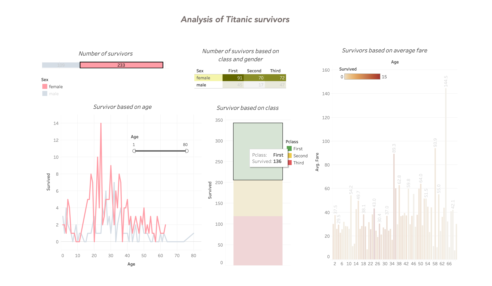
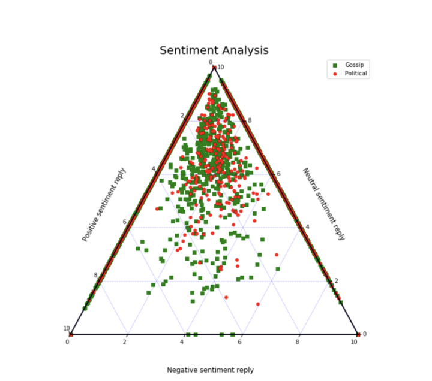
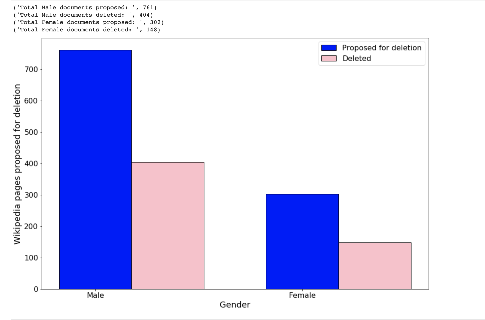

<!-- ---
title: "Portfolio item number 1"
excerpt: "Short description of portfolio item number 1 "
collection: portfolio
--- -->

<!-- This is an item in your portfolio. It can be have images or nice text. If you name the file .md, it will be parsed as markdown. If you name the file .html, it will be parsed as HTML.  -->

# Data Analysis Projects

## Covid Data Analysis

* **Purpose:** This project aims in Data Pocessing, Analysing and Visualizing of Covid data.

* **Skills:** Python: Pandas, Numpy, Scikit-learn, Mathplot

* Project link: [click here](https://github.com/RakshithaBrindha/pythonAnalysis/tree/main/covidDataAnalysis)

## Movie Recommendation system

* **Purpose:** If you're stuck for movie ideas on a Saturday night, here's a solution.

* **Methodology**: Data cleaning and analysis. Also created machine learning algorithm (content based filtering) for predictions of similar likeliness of movies.

* **Skills:** Python: Pandas, Numpy, Scikit learn

* Project Link [click here](https://github.com/RakshithaBrindha/pythonAnalysis/tree/main/movieRecommendation)

## WordCloud

* **Purpose:** The purpose of this project is to analyze and visualize the most recurrent word as a Word Cloud

* **Technologies/Tools:** Python: Matplotlib, Pandas, NLTK

* Project Link [click here](https://github.com/RakshithaBrindha/pythonAnalysis/tree/main/wordCloud)

## Analysing Titanic survior data

* **Purpose**: To analyze about the survival rate in Titanic and answer various hypothesis. 

* **Skills:** Python: Pandas, Numpy, Tableau

* **Results**

Screenshot of Tableau Dashboard

# Research-driven Projects

## Digital Consumer Behavior

* **Title**: How E-Trust influence online retail environment in a positive way?

## Research Lab

* **Title**: Skicky Fake News

* **Abstract:** We perform a study on the differential diffusion of fake political and gossip news stories distributed on Twitter as well as opinion mining on the social context of these news pieces. The data comprises FakeNewsNet, a versatile dataset containing fake and true news pieces. We find that fake political stories diffuse farther and significantly faster than fake gossip stories. However, when it comes to the total number of users involved (including followers) fake gossip stories seem to have higher numbers than fake political stories. We also found that the general sentiment of direct Tweets for political news is more negative whereas for gossip news it was neutral. This changed when examining the replies to these Tweets where political news had an overall neutral sentiment, whereas gossip news was related with a more positive sentiment. We interpret this as a possible enjoyment of fake gossip stories. [Click Here](https://drive.google.com/file/d/1SwDzhCQDBWdSt3E10e5UUxYx1dDolnDt/view) 

* **Results**

Sentiment Analysis

## Seminar

* **Title**: Wikipedia Article - Nomintions for Deletion (Gender bias)

* **Skills:** Python: Pandas, Numpy, Beautiful Soup

* **Results**
Nomination for deletion

## Master Thesis 

* **Title**: Towards Explainable Creativity - Remote Association Test

* Project Link: [Click Here](https://github.com/RakshithaBrindha/masterThesis)